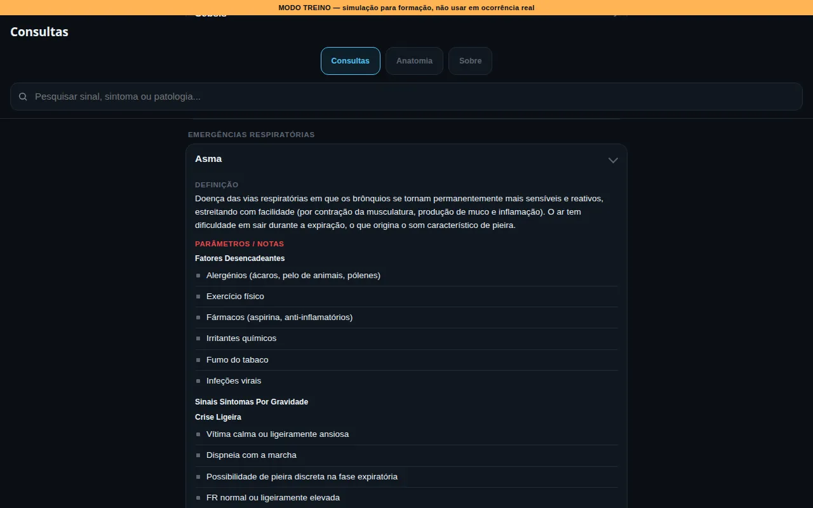
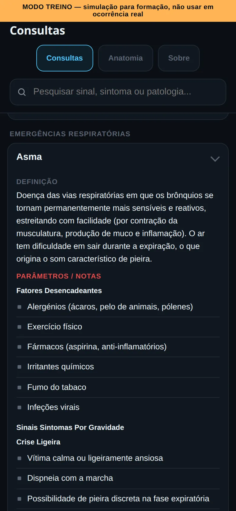
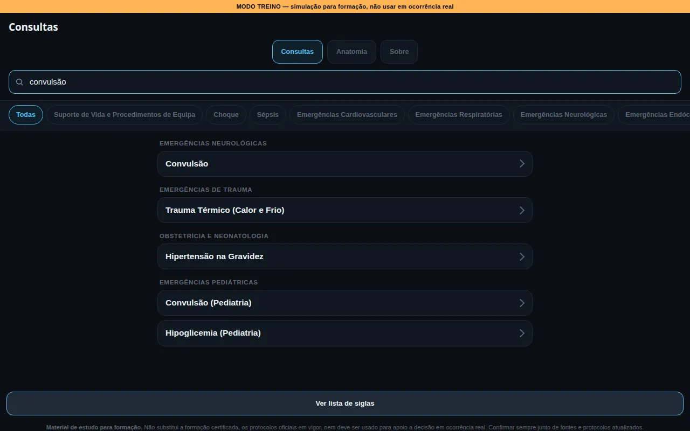
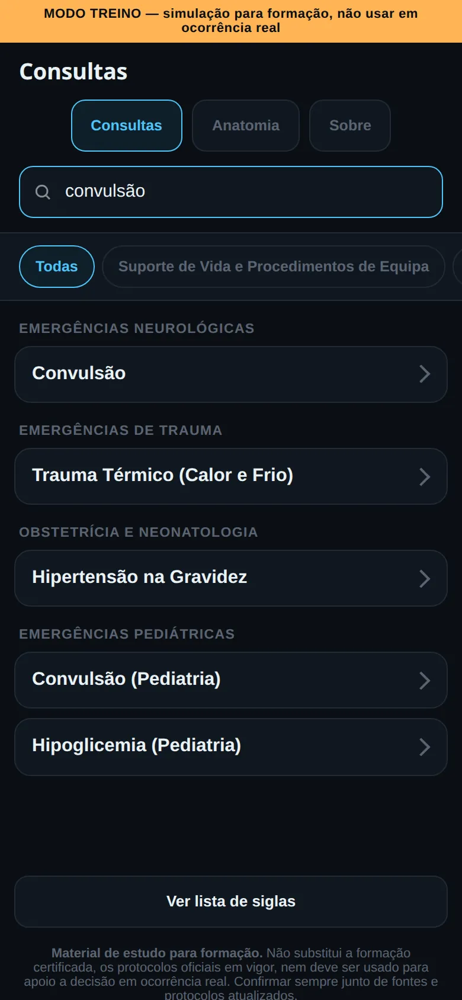
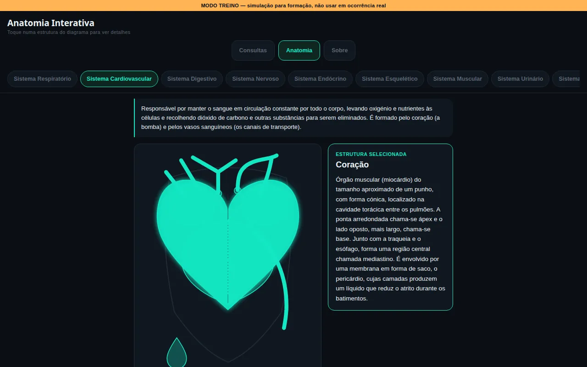
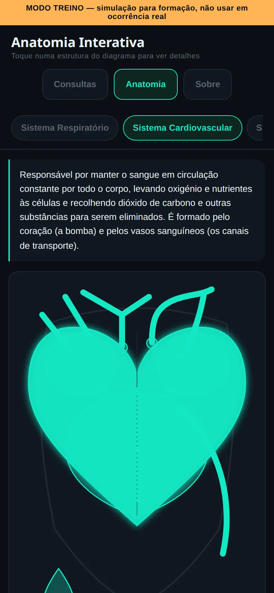
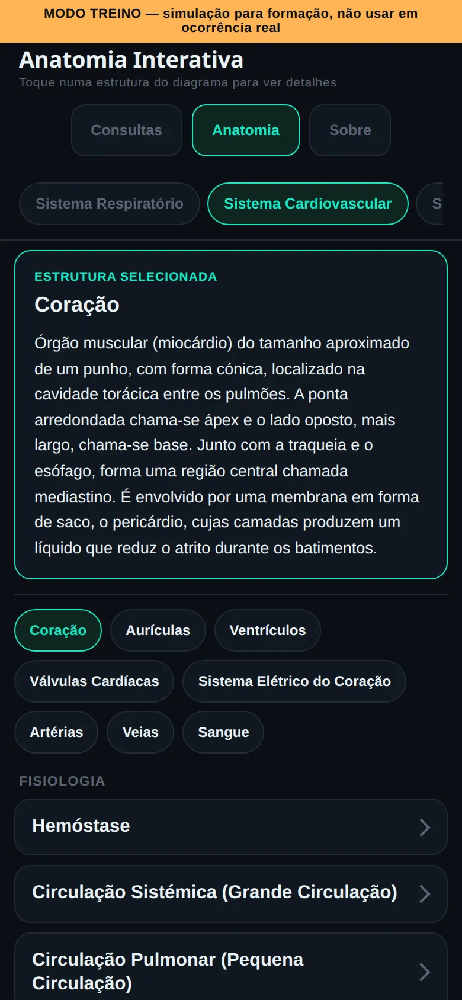

# Guia de Emergências

Guia de consulta rápida para emergência pré-hospitalar: 68 fichas de emergências médicas e de trauma pesquisáveis, e anatomia interativa dos 11 sistemas do corpo humano.

**[Abrir a versão online →](https://rolimjeferson26-cyber.github.io/guia-emergencias/)**

[](https://rolimjeferson26-cyber.github.io/guia-emergencias/)
[](LICENSE)

> [!WARNING]
> **Uso exclusivamente educativo.** Este guia é material de estudo para formação. Não substitui a formação certificada, os protocolos e algoritmos oficiais em vigor nem o juízo clínico, e **não deve ser usado para apoio a decisão clínica em ocorrência real**.

---

## Sobre o projeto

Durante a formação e a preparação, um bombeiro precisa de rever com frequência sinais e sintomas, critérios de gravidade e a sequência de atuação de dezenas de situações, além da anatomia que lhes dá contexto. Esta informação costuma estar espalhada por manuais e apontamentos. O Guia junta-a num só sítio, organizada por categorias, pesquisável e legível no telemóvel.

É pensado para:
- **formandos e bombeiros**, para estudo e revisão de conhecimentos;
- **formadores**, como material de apoio em sala de aula.

Criei este projeto a partir da minha experiência como Bombeiro EIP, para ter num formato de consulta rápida o conteúdo que uso para estudar e rever.

## Capturas de ecrã

| | Desktop | Telemóvel |
|---|---|---|
| **Consultas: ficha aberta** |  |  |
| **Pesquisa** |  |  |
| **Anatomia: sistema selecionado** |  |  |
| **Anatomia: descrição da estrutura** | *(no desktop, o painel aparece ao lado do diagrama, na captura acima)* |  |

## Funcionalidades

**Consultas**
- **68 fichas em 13 categorias**, de Suporte de Vida, Choque e Sépsis a Trauma (14 fichas), Obstetrícia e Neonatologia (12) e Emergências Pediátricas (12).
- **Fichas expansíveis** com definição, sinais e sintomas, atuação e informação específica de cada situação (critérios de gravidade, tabelas comparativas, valores de referência, escalas).
- **Pesquisa em todo o conteúdo das fichas**, sem distinguir acentos nem maiúsculas: procurar "convulsao" também encontra fichas onde a convulsão aparece só como sinal.
- **Filtro por categoria** através de botões no topo da lista.
- **Lista de 50 siglas** usadas nas fichas.

**Anatomia Interativa**
- **11 sistemas do corpo humano:** respiratório, cardiovascular, digestivo, nervoso, endócrino, esquelético, muscular, urinário, reprodutor, pele e órgãos dos sentidos.
- **Diagrama interativo:** tocar numa estrutura do diagrama mostra a sua descrição. Também é possível usar o teclado (Tab e Enter). No total são 69 estruturas descritas.
- **Lista de estruturas** de cada sistema, ligada ao diagrama, com uma introdução ao sistema e secções de fisiologia (26 no total).

## Arquitetura e tecnologias

- **HTML, CSS e JavaScript puros**, sem frameworks, sem dependências e sem passo de build.
- **Dados em JSON** (fichas e anatomia) e **diagramas em SVG**, um por sistema.
- **Arquitetura genérica na Anatomia:** a página é montada a partir do `anatomia.json`. Acrescentar um sistema é adicionar um objeto ao JSON e, opcionalmente, um ficheiro `anatomia_<id>.svg`, sem alterar o código.
- **GitHub Pages** para a publicação.

```
guia-emergencias/
├── index.html                 # Consultas: lista, pesquisa e fichas (dados embutidos)
├── anatomia.html              # Anatomia Interativa
├── estilo.css                 # Estilos partilhados pelas duas páginas
├── emergencias_medicas.json   # 68 fichas, 13 categorias, 50 siglas
├── anatomia.json              # 11 sistemas, 69 estruturas, fisiologia
├── anatomia_<sistema>.svg     # 11 diagramas, um por sistema
├── tests/                     # Testes dos dados (python3 tests/test_dados.py)
├── docs/screenshots/          # Capturas de ecrã deste README
└── LICENSE                    # Licença MIT
```

A página de Consultas traz o conteúdo do `emergencias_medicas.json` embutido num bloco `<script type="application/json">` e não faz pedidos de rede. A Anatomia carrega o `anatomia.json` e o SVG de cada sistema com `fetch`.

## Como executar localmente

```bash
git clone https://github.com/rolimjeferson26-cyber/guia-emergencias.git
cd guia-emergencias
python3 -m http.server 8000
```

Depois abre <http://localhost:8000> no browser.

**Porque não basta abrir o ficheiro com duplo clique (`file://`):** a Anatomia carrega os dados e os diagramas com `fetch`, e os browsers bloqueiam pedidos `fetch` a ficheiros locais abertos por `file://`. As Consultas funcionam por `file://`, porque têm os dados embutidos. Ainda assim, usar sempre o servidor local evita surpresas.

## Testes

Os testes estão em [`tests/test_dados.py`](tests/test_dados.py) e só usam a biblioteca padrão do Python:

```bash
python3 tests/test_dados.py
```

- Confirma que o `emergencias_medicas.json` e a cópia embutida no `index.html` são iguais.
- Confirma que a ficha pediátrica já não tem a tabela antiga de 12 faixas, nem a PAD, nem campos duplicados, e que indica a fonte.
- Confirma que os valores pediátricos da ficha batem com os do Simulador de Triagem (`parametros_vitais.json`). O simulador é procurado na variável `SIMULADOR_TRIAGEM_DIR`, em `../simulador-triagem` ou numa pasta ao lado com esse ficheiro. Se não for encontrado, este teste aparece como `IGNORADO`.

Também correm com o pytest (`pip install pytest`, depois `pytest tests`).

## Dados e fontes

- O campo `fonte` de `emergencias_medicas.json` descreve o conteúdo como *"compilado a partir de conhecimento clínico geral (sinais, sintomas, valores de referência e condutas amplamente reconhecidos na literatura de emergência médica). Não é a reprodução de nenhum manual, curso ou entidade formadora específica."*
- O mesmo ficheiro inclui um `aviso_legal`: os valores de referência podem ser atualizados e devem ser sempre confirmados junto das fontes e protocolos oficiais mais recentes.
- Os **parâmetros vitais pediátricos** da ficha "Abordagem e Avaliação da Vítima Pediátrica" (FC, FR, PAS normal e mínima aceitável, hipoglicemia e peso estimado, por grupo etário) seguem o manual INEM, "TAS – Emergências Pediátricas", versão 1.0, março de 2024, capítulo II (Quadro 1, p. 9; Quadro 4, p. 10; Quadro 7, p. 18; Quadros 8 e 9, p. 20; glicemia, p. 51). São os mesmos valores que o [Simulador de Triagem](https://github.com/rolimjeferson26-cyber/simulador-triagem) usa.
- O conteúdo de anatomia é descritivo e de nível introdutório, pensado para dar contexto às fichas.
- Todo o conteúdo está em ficheiros JSON separados do código, o que permite revê-lo ou corrigi-lo sem mexer na lógica.

## Limitações conhecidas

- **O conteúdo não foi validado por nenhuma entidade formadora.** Pode não coincidir com os protocolos em vigor na tua corporação ou entidade empregadora, e esses prevalecem sempre.
- **Os dados das Consultas existem em duplicado:** o `emergencias_medicas.json` e a cópia embutida no `index.html`. Uma alteração num tem de ser copiada à mão para o outro. O `tests/test_dados.py` falha se ficarem diferentes.
- **A Anatomia só funciona servida por HTTP**, seja localmente ou no GitHub Pages.
- **Os diagramas são esquemáticos**, servem para localizar e identificar estruturas, e não estão à escala anatómica.
- **A lista de siglas abre numa janela nativa do browser (`alert`)**, sem pesquisa.
- **Os testes cobrem só os dados** (cópia embutida e valores pediátricos), não a interface nem o `anatomia.json`.

## Próximos passos

Por ordem de prioridade, a partir das limitações acima:

1. **Acabar com os dados duplicados:** a página de Consultas passa a ter uma única fonte, em vez do JSON e da cópia embutida no HTML.
2. **Alargar os testes ao `anatomia.json`** (campos obrigatórios, ids únicos, um SVG por sistema).
3. **Lista de siglas numa janela própria, com pesquisa**, em vez do `alert` do browser.

## Projeto relacionado

**[Simulador de Triagem](https://rolimjeferson26-cyber.github.io/simulador-triagem)**: simulador de treino em que o formando regista os sinais vitais e os sintomas de uma vítima fictícia, e um motor de pontuação sugere as situações clínicas mais compatíveis. As fichas do simulador foram anotadas a partir das fichas deste guia. ([repositório](https://github.com/rolimjeferson26-cyber/simulador-triagem))

## Autor

**Jeferson Rolim**, Bombeiro EIP
- GitHub: [@rolimjeferson26-cyber](https://github.com/rolimjeferson26-cyber)
- LinkedIn: [Jeferson Rolim](https://www.linkedin.com/in/jeferson-rolim-023348437)

## Licença

O código deste projeto está disponível sob a [licença MIT](LICENSE).

A licença cobre o código. Os conteúdos clínicos (fichas, valores de referência e textos de anatomia) são material educativo e não substituem os protocolos oficiais em vigor nem a formação certificada.
